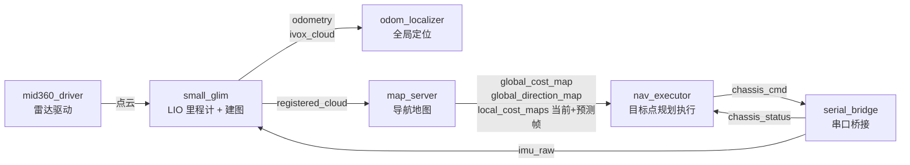
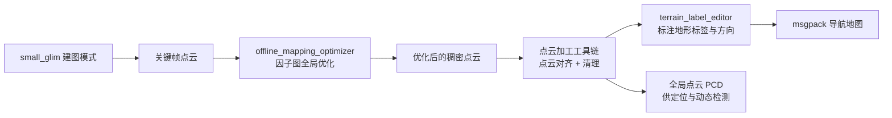
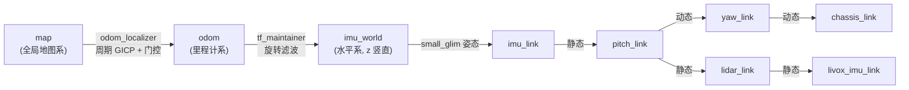
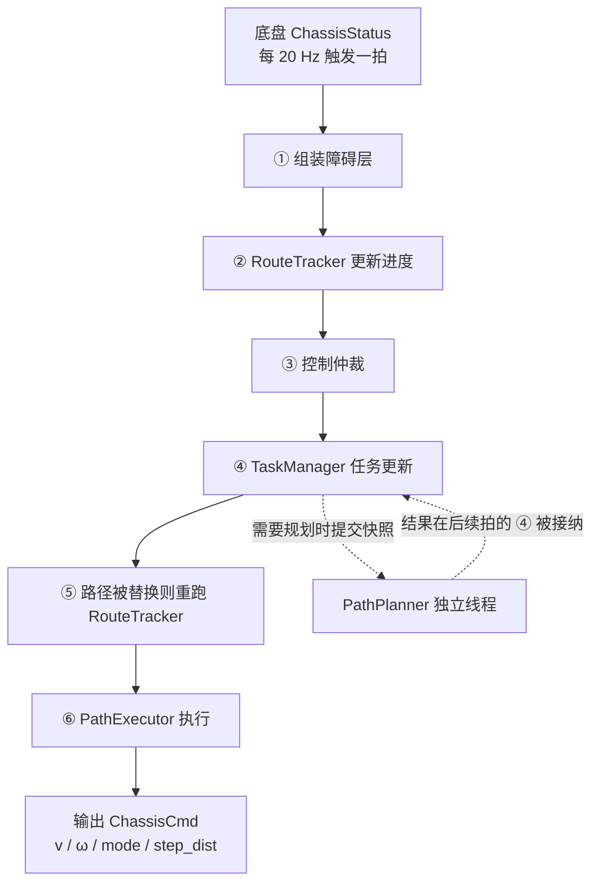
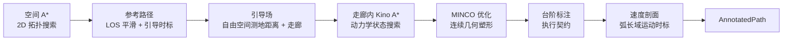
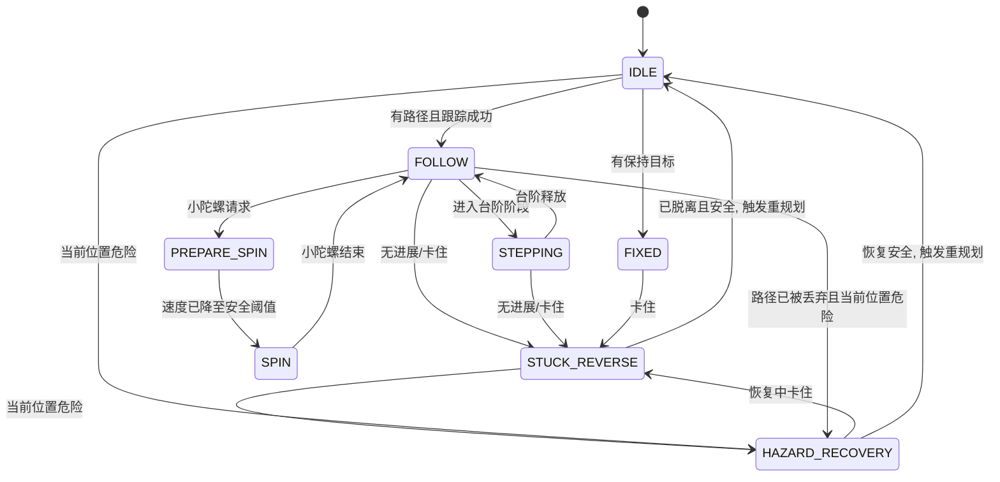

# HWSentryNav26 架构设计概述

本文档介绍 `HWSentryNav26` 仓库的整体架构与设计思路，目的是帮助读者在阅读代码之前先建立对整个系统的心智模型。

本文章由 LLM 生成（含人量0%），经过~~粗略的~~人工校对，可以~~不那么~~放心地食用。

## 目录

- [0. 系统定位](#0-系统定位)
- [1. 地图层](#1-地图层)
- [2. 里程计与定位层](#2-里程计与定位层)
- [3. 任务与规划层](#3-任务与规划层)
- [4. 路径执行层](#4-路径执行层)
- [5. 工具链](#5-工具链)

---

## 0. 系统定位

本项目是 RoboMaster 比赛轮腿哨兵机器人的自主导航系统。与普通四轮哨兵的导航不同，轮腿哨兵机器人能够跨越多种地形，其导航对象包含台阶、斜坡、飞坡等**可通行但需要特定底盘动作的地形**。本项目中导航框架输出速度、角速度控制指令以及底盘模式切换指令，具体的地形跨越动作（比如碰到台阶后收腿等）由底盘控制器执行，不由导航框架直接控制。

场地地形赛前已知，动态障碍只有场上机器人。因此系统采用"预先建图 + 离线标注 + 在线定位 + 在线规划执行"的架构。

### 0.1 系统总览

整个系统由 `HWSentryNav26`（本仓库）与 `HWSentryCommon26`（共享仓库，提供串口节点、TF 维护、接口定义）组成。导航相关的数据流如下：

其中 `map_server` 的全局代价图与地形方向场来自离线标注的 msgpack 地图；`nav_executor` 是路径规划与执行的核心，其余节点为它提供环境与状态。

### 0.2 章节与代码包对应关系

| 章节 | 对应代码 |
| --- | --- |
| 地图层 | `small_glim`（建图）、`map_server`、`utils/cpp/offline_mapping_optimizer` |
| 里程计与定位层 | `small_glim`（里程计）、`odom_localizer`、`mid360_driver` |
| 任务与规划层 | `nav_executor`：`task_manager`、`path_planner` |
| 路径执行层 | `nav_executor`：`path_executor`（FSM / MPC / 监控） |
| 工具链 | `utils/py`、`utils/cpp` |

---

## 1. 地图层

地图层回答"机器人知道什么"：静态场地结构（含地形语义）、动态障碍物及其未来位置。它由三部分组成：离线建图、导航地图表示、在线动态障碍层。

### 1.1 离线建图与地图优化

比赛场地图是赛前构建的，构建链路为：

**在线建图（small_glim mapping）**：`small_glim` 的建图模式由裁判系统比赛阶段触发（进入阶段 4 启动、离开阶段 4 停止），以关键帧（平移 0.1 m / 旋转 5°）为粒度把去畸变点云累积为 `mapping.pcd`。其特点是**延迟一帧的重去畸变**：由于轮腿颠簸剧烈，在线里程计的单帧去畸变可能不完美，建图线程因此缓存一帧前视，利用"本帧首端位姿 + 下一帧位姿"作为端到端先验，对帧内 IMU 轨迹做一次小规模优化后再去畸变，可以提高远点与运动剧烈时的点云质量（若轨迹末端与下一帧时间戳相差过大则回退到里程计已去畸变的点云）。

**离线全局优化（offline_mapping_optimizer）**：在线建图只依赖里程计，全局一致性不足。离线工具把关键帧组织成两级因子图：先做局部子图优化（相邻关键帧之间的 VGICP 匹配 + 里程计约束），再做全局子图图优化（子图间 VGICP + 回环检测），最后用射线投射滤波剔除动态障碍物残留，得到干净的全局点云。

**地图加工**：`utils/py/cloud` 提供点云对齐/清理 GUI 工具，`utils/py/map/terrain_label_editor` 用于在俯视高度图上标注地形标签与穿越方向，输出 msgpack 导航地图。

### 1.2 导航地图表示：地形标签 + 方向场

导航地图的 msgpack 包含两个等尺寸栅格通道：

- **terrain**：每个格子的地形标签——`FLAT / OBSTACLE / SLOPE / STEP_L1 / STEP_L2 / FLY_SLOPE / STEP_HIGH`。
- **direction**：每个格子的方向编码（0~255 → 0~2π），表示该地形的上行方向（如上台阶、上坡、正向飞坡）；沿该方向穿越为上行，反向为下行。

`map_server` 启动时按机器人颜色（红/蓝）加载对应地图，并离线一次性完成两类**物理距离膨胀**。平滑膨胀是必须的，而非锦上添花：下游的 MINCO（L-BFGS）与 MPC（FDDP）都是基于梯度的优化器，如果代价只在障碍格内跳变到 255、格外为 0，采样得到的代价场在边界附近梯度急剧变化甚至不连续，线搜索容易失败；同时离障碍超过一格后梯度恒为零，优化器从远处根本"看不见"约束。把信息抹成连续可导的场之后，约束以梯度的形式一路传播到远处，优化器就能提前、平滑地调整轨迹：

1. **代价膨胀**：障碍物周围按"满代价半径 + 指数衰减到截断半径"生成连续代价场。
2. **方向场传播**：方向约束同理——若穿越方向只在台阶本体格子内生效，代价同样在边界跳变。因此本体把穿越方向按同样的距离衰减向外传播：离台阶越近，方向信息越强。这里采用方向场的模长来表示方向约束的强弱。

方向场以 3 通道图像发布（角度 / 模长 / 标签）。模长区分两层语义：**地形本体**（模长 > 0.95，表示车体正位于地形上，穿越方向由地形本身决定，是硬约束的来源）与**膨胀圈**（模长封顶 0.9，只携带"附近有方向地形"的弱信息，用于软塑形）。下游把"是否处于本体"和"方向对齐程度"作为统一的连续特征使用。

### 1.3 在线动态障碍层

动态障碍物检测与预测全部在 `map_server` 中完成，输出"**当前帧 + N 个未来帧**"的局部代价图序列（1 个当前帧 + 20 个预测帧，预测步长 0.1 s，覆盖未来 2.0 s，与 MPC 时域对齐）。

**动态点提取**（两种模式）：

- **有全局点云**（推荐）：把累积的局部点云与全局点云做最近邻查询，距离超过阈值的点视为动态。简单可靠，因为场地静态结构都在全局点云里。
- **无全局点云**（兜底）：基于法向量分析（垂直面为动态候选）并利用方向场模长过滤掉台阶等已知静态结构，精度较低，预测功能默认关闭。

提取后的动态点先在点云域做统计离群点过滤（SOR），再投影为二值障碍掩码；随后在栅格域依次做点密度阈值（防止单点噪声成障）与连通域面积过滤（剔除散落噪声格），最后膨胀为当前帧代价图。

**目标跟踪与预测（ObjectTracker）**：障碍掩码只回答"这一帧有哪些障碍"，要预测它们未来 2 秒的位置，还必须把帧间的障碍对应起来。处理分为四步：

1. **检测**：对掩码做形态学闭运算与连通域分析，得到本帧的目标列表（质心 + 形状）；
2. **关联**：把本帧目标与既有航迹一一配对（按质心距离做最优匹配，距离超限视为新目标）——解决"上一帧的那个目标现在是哪个"；
3. **跟踪**：航迹对质心做恒速滤波，目标形状以"局部足迹栅格"保存并在帧间衰减融合——形状参与预测渲染，避免只跟踪质点而丢失形状信息；
4. **外推**：确认稳定（连续命中数帧）的目标按衰减速度模型外推未来 20 步的质心位置，把足迹模板平移合成各预测帧代价图。

两个细节值得注意：

- **静态保底**：未进入运动预测链路的目标（新目标、短暂丢失）会作为静态障碍写入所有未来帧——"不预测"不等于"消失"，保证保守。
- **膨胀只做一次**：每个目标足迹只膨胀一次，随后平移合成各帧，避免逐帧重复膨胀的计算开销。

---

## 2. 里程计与定位层

定位层回答"机器人现在在哪里"。它由两个节点协作：`small_glim` 提供高频、平滑、起点未知的里程计（odom 系），`odom_localizer` 提供低频、绝对、有质量门控的全局定位（map 系）。

### 2.1 坐标框架

TF 树由 `HWSentryCommon26/tf_maintainer` 维护。`imu_world` 是 z 轴竖直的水平系，其相对 odom 的旋转做了强滤波，供依赖重力方向的模块使用。

### 2.2 里程计（small_glim）

`small_glim` 是基于因子图优化的激光-惯性里程计，流水线为：

1. **IMU 初始化**：利用开机窗口内的 IMU 加速度估计重力方向与初始姿态。
2. **点云预处理**：降采样、距离过滤、按时间排序、剔除坏点；为每个点计算 K 近邻协方差（供 GICP 使用）。
3. **逐帧估计**：每帧点云先用 IMU 预积分结果去畸变（消除扫描期间自身运动造成的点云拉伸），再与局部地图做扫描-地图匹配（iVox GICP 或 VGICP）。匹配与 IMU 预积分进入同一个**固定滞后平滑器**联合优化。两类约束互补：扫描-地图匹配把每一帧位姿"钉"在局部地图上，直接限制轨迹相对地图的漂移，但它依赖点云质量——在长走廊、空旷区域等退化场景或剧烈颠簸导致点云畸变时，匹配会变弱；IMU 预积分则完全不依赖点云，它约束"两帧之间机器人经历了怎样的相对运动"，在匹配退化时依然能兜住帧间运动，高频采样也让颠簸中的运动估计保持平滑。两者放在一起相互校正：匹配持续校准 IMU 积分随时间累积的误差，顺带把 IMU 零偏（加速度计/陀螺仪的常值偏差）也作为状态估计出来，而不是当作固定标定值。因子图只保留最近约 3 秒的位姿窗口，窗口外的状态被边缘化——窗口足够长，让上述相互校正得以发生；又足够短，让每帧的优化规模控制在实时范围内。
4. **异步执行**：预处理、匹配、建图在独立线程与队列中解耦，控制线程只负责取结果，保证雷达帧率波动不阻塞整机。

针对轮腿机器人的两个特殊处理：

- **撞击暂停**：轮腿跳跃/落地瞬间 IMU 数据饱和（加速度或角速度任一轴超过阈值），帧内去畸变与帧间积分都不可信；此时若继续把新帧插入局部地图，会污染后续匹配目标。饱和帧本身直接丢弃不入图，并且此后暂停插入约 0.5 s。
- **滞后插入**：新帧延迟 0.5 s 才插入局部地图，保证插入时用的是优化后的位姿，而不是刚预测出来的位姿。

### 2.3 全局定位（odom_localizer）

`odom_localizer` 使用 GICP 精匹配维护 `map→odom` 变换，把里程计的 odom 系对齐到全局地图上。其设计哲学是：**定位的正确性优先于频率**——`map→odom` 的任何跳变都会直接传导给规划与 MPC（机器人瞬间"瞬移"，路径投影和 MPC 初值全部出错），因此每一拍更新都要过质量门。

流程：

1. **启动引导**：开局收到裁判系统机器人颜色后，用启动区的已知位姿初始化 `map→odom`；前 10 s（bootstrap 阶段）用 `registered_cloud` 滑动窗口累积的点云作为配准源——刚开机时 `ivox_cloud` 局部地图还没长起来，累积多帧才能得到足够稳健的观测。
2. **周期重定位**：配准按固定周期（1 s）触发，bootstrap 阶段与之后都是同一个周期；10 s 后配准源切换为里程计维护的局部地图快照（`ivox_cloud`），与先验地图做 GICP 配准。
3. **质量验收**：只有满足收敛、误差、重叠率、信息矩阵正定性与条件数等全部指标的配准结果才被接受。信息矩阵分析等价于可观测性检查：在长走廊等退化场景中，退化方向（沿走廊方向）上几乎没有匹配约束，该方向的"修正"会被拒绝，防止定位被拉偏。
4. **跳变门控 + 平滑**：相邻两次被接受的定位结果若平移/旋转突变超限则丢弃；正常更新经 EMA 平滑后写入 `map→odom`。

---

## 3. 任务与规划层

`nav_executor` 是系统的主要执行器，内部按职责划分为四块：顶层控制循环、任务管理（`task_manager`）、规划器（`path_planner`）、执行器（`path_executor`，见第 4 章）。

### 3.1 顶层控制循环

**控制频率由底盘状态驱动**：`nav_executor` 不设独立控制定时器，而是以底盘反馈（`ChassisStatus`，20 Hz）的每次到达作为一拍的触发源。这样控制周期与底盘反馈天然同步，不存在两个时钟的相位混叠；底盘掉线由看门狗检测，节点停止输出新指令并使 MPC 命令状态失效，等待底盘恢复后重新同步。

每一拍的控制流程：

①～⑥ 都是 `nav_executor` 内部的组件，顺次完成一拍；规划是唯一异步的部分——本拍提交后控制照常继续，结果在后续某一拍的 ④ 中被接纳（代次不匹配的结果被丢弃）。

②与⑤是同一个 `RouteTracker` 跑两次，不是冗余：②在旧路径上算出进度，③④才能用它判断台阶是否已 commit、路径是否该被替换；一旦④真的换了路径，新路径上的进度必须在本拍就重新算出来，⑥才有可用的参考。这也是"新路径就绪后直接接管、不必先停稳"能成立的原因。

**输入仲裁（③）**：底盘控制权在导航、小陀螺与安全恢复之间分配。冲突场景很具体：高优先级小陀螺是哨兵的生存需求（被击打时停止路径跟随并快速旋转），需要能随时打断正常路径跟随；但台阶动作正在执行时又绝不能被打断（不能在台阶上停止小陀螺）。仲裁先决定控制归属（`ControlOwner`：空闲 / 导航 / 低优先级小陀螺 / 高优先级小陀螺），再由它导出一个"导航访问权限"（`NavigationAccess`）三态，决定**谁有权动路径**：

- **可用（AVAILABLE）**：正常状态，可替换路径、可提交规划；
- **锁当前（LOCK_CURRENT）**：台阶 COMMITTED 等不可抢占阶段——保留当前执行，冻结路径替换与规划；
- **撤销（REVOKED）**：高优先级小陀螺——当前执行产物失效，任务语义保留，小陀螺结束后从当前位置重规划。

### 3.2 任务管理（TaskManager）

任务层维护"当前目标"与"当前路径"，并管理规划器的调度。关键机制：

- **latest-wins 目标**：新目标立即取代旧目标（按距离去重）。若当前阶段可抢占，旧路径同时失去执行权——机器人先减速等待，新路径就绪后直接接管，而不是先停稳再出发。
- **规划代次（generation）**：规划运行在异步线程，慢请求的结果可能比快请求晚到。每次目标变化或路径失效都推进代次，只有代次匹配的结果才被接纳——旧地图快照的晚到结果永远不会重新获得执行权。
- **hold goal**：`fixed` 目标到达后进入"保持"状态。平衡轮腿机器人底盘并不稳定，有时需要主动保持固定位置（比如回家补血）。MPC 对固定点做稳态控制（见 4.3）。
- **失败冷却**：同一目标规划失败进入短冷却再重试——目标可能真的不可达（被完全包围），避免以 20 Hz 空转烧算力。

**重规划触发（RouteMonitor）**：运行期对当前路径持续监控，失效即触发重规划。触发原因分为几类：

| 类别 | 原因 | 含义 |
| --- | --- | --- |
| 跟踪失效 | `ROUTE_TRACKING_LOST` | 进度估计误差超限 |
| 路径被障碍破坏 | `PROJECTION_OUT_OF_MAP` / `PROJECTION_COST_EXCEEDED` | 底盘到参考点的投影段越过地图边界或代价超限 |
| 台阶通道被占 | `STEP_BLOCKED_CURRENT` / `STEP_BLOCKED_PREDICTED` | 前方台阶通行区被动态障碍占据；后者按速度剖面的**预计到达时间**在预测帧中判定 |
| 预测撞障 | `MPC_LETHAL` | MPC rollout 命中致命障碍（见 4.3） |
| 性能变化 | `PERFORMANCE_DEGRADED` / `PERFORMANCE_RECOVERED` | 高性能能力（超级电容、缓冲电容可用电量与裁判系统功率上限三者同时达标）丢失或恢复，影响前方地形能否用需要高性能的模式跨越 |
| 外部抢占 | `HIGH_PRIORITY_SPIN_PREEMPTION` | 高优先级小陀螺抢占 |
| 内部恢复 | `EXECUTOR_REPLAN_EVENT` | 恢复链结束后执行层发出的一次性重规划事件 |

### 3.3 规划管线（PathPlanner）

规划器运行在独立线程（latest-wins 提交语义），一次规划产出不可变的 `AnnotatedPath`。管线是"**粗到细、分阶段降维**"的典型设计——每一步只解决一类问题，避免在完整状态空间上直接搜索：

1. **空间 A\***（拓扑）：在 2D 栅格上搜索，只解决"从哪边绕过去、穿过哪个地形通道"。代价包含障碍距离与地形穿越合法性，并记录地形通道（入口/出口）供后续阶段对齐方向。
2. **参考路径与引导场**（几何与引导）：对空间路径做保持通行的 LOS 平滑（地形本体格子原样保留，只在平地段做贪心的最远可见点连线），采样出带切向、曲率、速度见证的参考点序列；再以参考路径为源做自由空间测地距离场，提取固定宽度走廊。走廊是后续动力学搜索的"可信区域"——把搜索空间从全图压缩到路径邻域，同时保留绕障后的正确拓扑。
3. **走廊内 Kino A\***（动力学）：在走廊内以运动基元库（由曲率档与弧长档组合生成，量化到 `(x, y, heading, speed)` 格点）做动力学搜索。它验证"用真实可执行的运动基元能否走通"，并为每个基元产生切向/曲率/时长见证。起点航向允许小幅松弛（多个起始搜索根），避免前方被障碍物堵住导致规划失败。
4. **MINCO 连续优化**（几何塑形）：以 Kino A\* 路径为种子，用分段五次多项式（MINCO 参数化）做连续优化。决策变量是内部路点与参数时长，目标包含：min-jerk 能量、参数总时长（起长度正则的作用，抑制绕远）、障碍代价、曲率与曲率变化率、有向约束（穿越方向与地形方向对齐）、禁止方向惩罚、台阶速度约束、助跑区曲率正则。关键不变量：**几何与时标解耦**——MINCO 的参数时长只是几何优化的内部坐标，不进入执行。原因：执行时标完全由速度剖面决定（见阶段 6），若在几何优化里同时优化真实时间，等于在优化一个执行层根本不消费的变量，还会让几何与速度互相干扰。
5. **台阶标注**（执行契约）：沿弧长扫描方向地形本体，为每个台阶生成完整生命周期——`prepare → armed(激活底盘模式) → committed(开始物理动作) → enter → exit → release`，附带该地形允许的底盘模式、能力档与速度窗。**执行层不再解释地图，只消费这份契约**（见 4.2）。标注必须先于速度剖面：速度剖面要把台阶速度窗作为软约束消费，才能提前在台阶前把速度"钉"进速度窗内。
6. **速度剖面**（运动时标）：在固定几何上用 `v(s)²` 为决策变量求解弧长域速度曲线。速度、角速度与切向加速度是硬约束（节点上界与相邻节点步长限制），角加速度也按硬约束处理，但由于它同时受 `κ'v²` 与 `κ·a_t` 两项影响，实现上把角加速度上限在两者之间做了保守的 50/50 预算切分，因此是一个**偏保守的近似**而非精确约束。这些上限都来自底盘**能力档**——低 / 中 / 高三套能力参数（速度、角速度及其变化率上限），执行期按地形切换（见 4.2）。侧向加速度与第 5 步标注的**台阶速度窗**是软约束（进入目标函数）。它把"规划参考"与"执行能力"对齐，保证 MPC 有可跟踪的参考。

> **为什么弧长统一**：几何、速度剖面、台阶阶段、进度跟踪、MPC 虚拟进度若各用各的参数（时间/最近点/索引），任何一处重采样都会引入歧义。统一以弧长为坐标后，"路径包"可以在规划线程不可变地生成、在执行线程被无歧义地消费。

**助跑（run-up）**：部分地形动作的触发点不在物理边缘——例如跳跃上台阶，起跳位置在台阶前方一段距离。因此该地形的约束区（速度窗、方向对齐、曲率正则）从"动作触发点"开始，而不是从台阶物理边缘开始：车体必须在进入台阶之前就达到目标速度并保持方向。这同时给 MPC 留出余量——预测与实际总有偏差，控制器需要提前收敛到目标状态，而不是临到边缘才被迫调整。这就是 MINCO 代价中"run-up 区曲率正则"（助跑段应近似直线）与速度剖面中台阶速度窗提前生效的由来。

规划完成后还要做两件事：一是**环境验收**（逐段采样验证轨迹不撞障碍、方向地形对齐达标、未使用禁止方向），二是生成**路径相关掩码层**（沿路径擦除已选台阶通道后的方向场、台阶本体代价层），供执行层的安全判定使用。

---

## 4. 路径执行层

执行层消费 `AnnotatedPath`，以 20 Hz 输出底盘命令。它由进度跟踪、运动 FSM、台阶运行时、MPC 与安全监控组成。

### 4.1 进度跟踪（RouteTracker）

执行的第一步是回答"机器人在路径的哪个位置"。

最直观的做法是最近点投影：把当前位置垂直投影到路径上，取最近点对应的弧长。但考虑动力学的路径有可能会出现回绕或者打结，路径可能两次经过同一片区域；此时最近点会在两个弧长几乎相等的位置之间跳变，进度忽前忽后，台阶阶段判定与路径监控都会跟着抖。

`RouteTracker` 因此把进度建模为**有向路径上的时序状态** `(s, ṡ)`，用多帧观测而不是单帧投影来推断：

- 位置矢量 + 地图系速度矢量共同观测 `(s, ṡ)`：速度方向能区分"我在沿路径前进还是倒退"，这是单帧最近点无法回答的；
- 同时维护多个竞争的弧长假设（沿路径等间距分布），每帧观测按似然给各假设加权、淘汰不合理的分支——某一次观测把"正确进度"认错，不会让系统永久锁死在错误分支；
- 在同一条路径上，对外报告的进度**单调不减**——即使假设切换，也不会出现进度回退（换路径或跟踪重置时进度自然重新从头开始）。

进度的质量直接决定台阶阶段判定与路径监控的正确性，因此它被设计为带冗余的估计器而非简单投影。

### 4.2 运动 FSM 与台阶生命周期

执行层由一台有限状态机驱动。状态分三类：**正常运动**——`FOLLOW`（跟随路径）、`STEPPING`（执行台阶）、`FIXED`（保持固定点）、`SPIN`（小陀螺）；**异常处理**——`STUCK_REVERSE`（倒车脱困）、`HAZARD_RECOVERY`（危险脱困）；**过渡**——`IDLE`（无事可做）、`PREPARE_SPIN`（进入小陀螺前的减速互锁）。此外还有一个 `DEAD`，它不是状态机内部的状态，而是底盘不可控（比赛未开始、腿处于 Dead/Recovery/Abnormal）时在状态机之前就返回的结果。

`STEPPING` 内部还有一个正交的台阶子状态 `StepPhase`（`PREPARING / ARMED / COMMITTED`），它决定当前执行是否可被抢占，见下文台阶生命周期。

下图只画主要转移条件（`FIXED`、`SPIN`、`PREPARE_SPIN` 的危险与卡住入口、以及各状态的取消边未画全）：

恢复链的出口需要注意一个细节：`STUCK_REVERSE` 与 `HAZARD_RECOVERY` 结束时走的是同一个收尾逻辑。如果这次恢复是从 `FOLLOW` / `STEPPING` / `FIXED` 因卡住进入的（也就是有一条正在执行的路径被打断了），收尾会先落到 `IDLE` 并发出一次性重规划事件，等新路径到位再继续；只有恢复链本来就不是从执行中的路径进入的（例如从 `IDLE`、`SPIN` 进入），才会直接回到 `FOLLOW` / `FIXED` / `IDLE`。所以图上 `→ IDLE, 触发重规划` 是常见路径，而不是例外。

**台阶生命周期**：为什么要给下位机"预告"？下位机必须先收到模式命令、完成机械准备，并可能在动作期间**独占底盘**（不能同时响应速度指令）。导航方若临到台阶边缘才发模式命令，下位机来不及准备。因此每个台阶在规划期就被标成弧长上的一串里程碑：

| 里程碑 | prepare | active | commit | step_enter / step_exit | release |
| --- | --- | --- | --- | --- | --- |
| 语义 | 能力档开始渐变 | 发送模式命令 | 动作开始（预估） | 物理跨越 | 释放恢复 |

执行期的台阶子状态 `StepPhase` 由车体越过哪个里程碑决定：越过 `prepare` 进入 `PREPARING`，越过 `active` 进入 `ARMED`，越过 `commit` 进入 `COMMITTED`。

- **PREPARING**：距台阶尚远时开始（提前 commit 点 2.5 m）。能力档（速度/加速度上限）开始按每控制周期固定增量向目标档渐变——台阶动作前后底盘的物理极限不同，换档必须提前、不能突变。注意这个渐变是**时间域**的（每拍走一步），不是沿弧长插值的；
- **ARMED**：开始向底盘发送台阶模式命令，底盘进行动作准备，但真正跨越动作尚未开始；
- **COMMITTED**：车体进入物理动作不可逆区间。此阶段**锁定路径替换**——普通的新目标、小陀螺请求都不能撤销当前执行；只有路径硬失效（进度丢失、当前位置危险）才能打断，且打断必须携带"台阶取消"语义（撤销底盘模式、回退 NORMAL）。

**下位机侧的"预告 + 独占"协议**：腿模式反馈（`DEAD / RECOVERY / FLIGHT / JUMP / MATURE / STEP / ABNORMAL`）与导航构成闭环，导航把它归纳成三种底盘可控状态：

| 可控状态 | 触发条件 | 导航行为 |
| --- | --- | --- |
| `NORMAL` | 腿为 `MATURE` | 正常下发 MPC 命令 |
| `BLOCKED` | 腿为 `STEP` / `FLIGHT` / `JUMP` | 腿正在做动作、独占底盘；执行器**保持上一帧命令**（含 mode 与 step_dist）而不是下发新命令，动作期间底盘只服从下位机自己的控制律 |
| `STOPPED` | 腿为 `DEAD` / `RECOVERY` / `ABNORMAL`，**或**当前不在比赛阶段 | 底盘不可控，直接下发零速 NORMAL，对外报告 `DEAD` |

注意 `RECOVERY` 属于 `STOPPED` 而不是 `BLOCKED`：腿在恢复模式下不是"正在执行导航要求的动作"，而是根本不接受导航控制。另外比赛阶段是一个独立的前置条件——不在比赛中时无论腿是什么模式都按 `STOPPED` 处理。

### 4.3 MPC 控制

MPC 是执行层的核心控制器，负责把路径包变成底盘命令。

**为什么不能直接 PID**：轮腿底盘的纵向响应是典型的**非最小相位系统**——指令阶跃后，实际速度会先向反方向冲一下再跟上（腿要先向后摆才能取得加速度），伴随强滞后与超调。普通 PID 或简单模型的 MPC 面对这种动力学的控制效果不佳。

MPC 每拍求解一次"未来 2 秒的最优控制问题"（预测时域 40 步 × 50 ms）：给定当前状态与路径参考，找到满足全部约束（速度/角速度及其变化率边界、台阶速度窗）且代价最小（跟踪误差、命令平滑、避障）的控制序列，只执行序列的第一步，下一拍重新求解（滚动时域）。注意求解节奏由底盘反馈驱动（见 3.1），50 ms 是预测模型的离散步长，不是一个独立的求解定时器。跟随全局路径、控制跨越台阶时的速度/方向、绕障、命令平滑这些相互冲突的目标，只有放在一个优化问题里统一权衡，才能得到一致的行为。

**模型问题**分三个层面解决：

- **模型结构**：使用 LPV（调度线性模型）——参数随等效腿高连续变化。腿伸直冲刺与腿蹲下慢行的响应特性不同，固定线性模型可能难以覆盖；
- **模型来源**：系数从实车录制的命令-响应数据离线辨识（见第 5 章），而非手工标定；
- **不完美模型的补偿**：模型包含一个不可直接测量的内部状态（速度响应之外的底盘动态），由观测器从实测速度序列在线估计。此外还有一个可选的管式辅助环：名义 MPC 在收紧的包络上求解，留出余量给辅助环在名义解附近对**纵向**命令做保守修正，用来抑制模型误差；它只在观测器自检通过后才生效，且当前配置里默认关闭（模型辨识准的情况下名义解本身够用）。

**状态空间与命令生成**：12 维状态 = 位姿 (x, y, θ) + 纵向隐状态 + 实测速度/角速度 + 命令及其变化率 + 路径进度 (s, ṡ)；3 维控制 = 线速度指令变化率、角速度指令变化率、虚拟进度速度。命令变化率作为控制量，保证输出的速度指令本身连续，下位机可以直接执行。

**求解器**：选用实时 FDDP（可行性驱动 DDP）——后向传递用箱式 QP 直接处理控制边界（控制维度只有 3，可以直接枚举激活集），并配合 Levenberg 型正则；前向搜索用 Armijo、代价下降与 filter 准则三者取或作为接受条件，再叠加控制与状态两级信赖域，能在毫秒级迭代中兼顾约束与非线性。三种问题共用同一求解器：**Follow**（跟踪路径）、**Stop**（停车）、**Hold**（保持固定点）。其中 Stop 与 Hold 使用独立的**双向能力档**（允许负速度），因为停车制动与危险恢复都需要倒车；三档地形能力档（低/中/高）都是非负速度的，只用于规划与跟随。

**冷启动种子**：Follow 的初始解沿已认证路径做纯追踪前推生成——让初始猜测一开始就大致沿路径走，避免陷入错误的局部最优。**暖启动**：相邻控制周期间平移上一帧解序列，收敛更快。

**命令安全（rollout 检查）**：求解完成后，把整条预测轨迹在"静态 + 台阶掩码"硬成本层上做一次致命障碍检查——任何一步命中即拒绝该 rollout，本周期改发 STOP 命令（坏解不暖启动），连续拒绝达到阈值（默认 3 拍）才上报 `MPC_LETHAL` 触发全局重规划。命令安全与重规划是两个独立策略：**命中的瞬间就必须停，是否重规划由连续命中次数决定**。

这里有一个例外：台阶进入 COMMITTED 之后跳过该检查。原因与 4.2 的"不可打断"是同一个：动作已经开始，停车比继续跨越更危险，此时"停下来"不再是一个安全的选项。

**预测时域的消费**：`map_server` 的未来代价帧按 stage 时间对齐进入 Follow 代价（每个 stage 取不晚于它的最近一帧），MPC 的预测因此"看到"动态障碍的未来位置，而不是只躲避当前位置。

### 4.4 失效检测与恢复链

执行层假设"正常跟随会失败"，并且失败往往不是"重规划一次"就能解决的：机器人可能被台阶边缘卡住（有指令、无位移），可能贴进障碍物（当前位置已在危险区）。此时直接重规划几乎必然失败——规划器要求起点可行，卡住的位置无法通过起点检查。因此必须先**物理脱困**，再谈规划：

1. **无进展检测**（ProgressMonitor）：以弧长里程碑为地标，一段时间内未越过地标即判定无进展（台阶 COMMITTED 前后使用不同参数——台阶动作期间速度较慢是正常的）。
2. **卡住检测**（SafetyMonitor）：有速度指令但位移长时间不增长判定卡住。
3. **危险判定**：当前位置的硬成本或方向场模长超限即判为危险（地图外默认危险）。
4. **恢复链**：无进展/卡住 → `STUCK_REVERSE`（以固定速度倒退固定距离；另有超时保底，即使倒车位移一直不够也会强制退出，避免恢复动作本身变成新的死锁）→ 若倒退后仍危险则进入 `HAZARD_RECOVERY`（在周围按半径/角度采样搜索安全点，用路径积分代价选出最优目标，hold 控制驶向目标，并要求安全条件连续保持一段时间才算恢复完成）→ 若这次恢复打断了一条正在执行的路径，则触发一次性重规划事件，任务层从当前位置重新规划。

被打断的路径不会"回到旧路径"：它的执行生命周期已经作废，必须从新位置重新建立。这也是恢复链先落到 `IDLE` 等新路径、而不是直接回 `FOLLOW` 的原因（见 4.2）。

---

## 5. 工具链

`utils` 下有一些小工具便于日常调试，按用途分组：

- **点云加工**（`cloud/`）：点云清理/编辑 GUI（`clean_cloud_gui`、`edit_cloud_gui`）、地面补面（`draw_planes_gui`）、坐标系对齐（`transform_cloud_3pts` 三点粗对齐、`transform_cloud_manual` 手动微调、`icp_align_cloud_gui`）、高度图生成（`cloud_to_height_map`，没什么用）、CAD 模型转换（`step_to_stl`、`stl_to_pcd`、`cloud_to_trimesh`，没什么用）。
- **地图标注**（`map/`）：地形标注（`terrain_label_editor`）、分辨率重采样（`resample_map_resolution`）。`edit_map_gui_deprecated` 已废弃。
- **标定**（`calib/`）：激光-IMU 外参标定数据采集与标定。这个是之前的遗留工具，效果其实并不好（但是我用这个发现了电控发送的 IMU 存在杆臂补偿问题）。
- **MPC 模型辨识与评估**（`mpc/`）：采集命令-响应激励数据（`rec_identify_data`）、辨识 LPV 模型（`identify_lpv_mimo`）、模型前向预测与评估（`predict_lpv`、`evaluate_lpv_model`）、离线优化观测器增益与辅助环参数（`optimize_observer`、`optimize_ancillary`）、录包分析（`extract_data_from_bags`、`mpc_analysis/`）。
- **在线调试**：目标点发送/巡检（`msg/patrol_nav_goal`、`msg/nav_goal_relay`）、底盘命令模拟（`msg/send_chassis_cmd`、`msg/send_chassis_cmd_interactive`）、其他话题灌数据（`msg/send_comp_stage_4`、`msg/send_joint_state`、`msg/send_odometry`、`msg/send_empty_cloud`、`msg/send_decision_gimbal_cmd`）、预测地图调试（`msg/extract_predicted_costmaps`）、TF 调试（`tf/`）、位姿换算（`pose/`）、单机仿真（`sim/wheel_leg_lqr_follow_sim`）。
